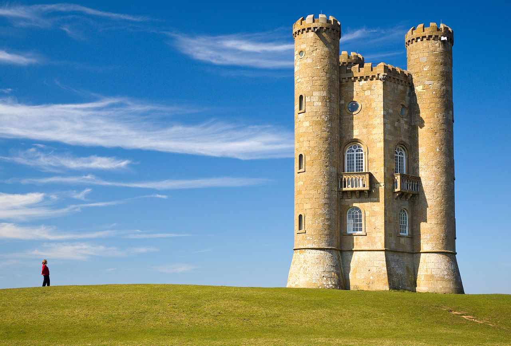
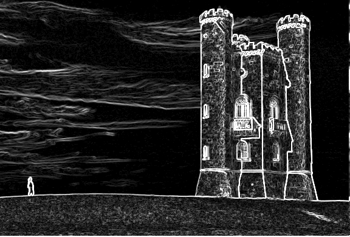
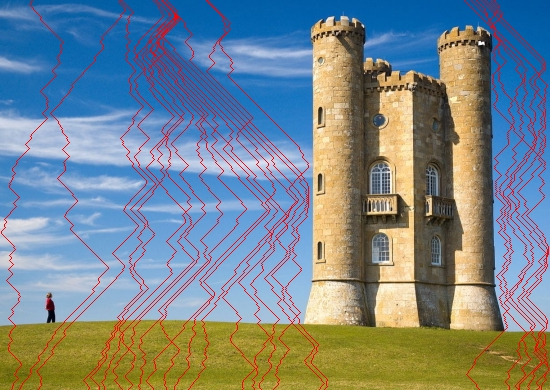

# Seam carving for content aware image resizing

Seam Carving, also known as Content Aware Image-Resizing, Image Retargeting, is a technique to "smart" resize the images. The technique basically resizes images based on the content of the image i.e. it preserves the content in order of its importance. The goal of this project is to implement seam carving and use it to retarget images. In order to do this we need to find optimal seams of low energy and remove it

## Process

1. Determine size change of image (width or height) and by how many rows/columns
2. Create energy map of image by finding the gradients of the image using Sobel filter
3. Determine vertical seams that have the minimum cumulative energy based on size change
4. remove seams from image and repeat steps 1-3

# Example

Input image -

 

After applying Sobel filter to get the gradients of the image

 

Finding seams in the image

 

Cropped image

